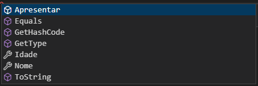

# Curso de C# da Dio.me - Modulo de propriedades, metodos e construtores

## Criando uma classe e a sua propriedade na pratica

    1.  Foi criado uma pastal 'Model', na qual estara contido todas as classes utilizados no projeto;
    2.  Com o botao direito, crie um arquivo 'Class' e de uma nome para ele;
    3.  Escreva dentro da linha de programacao 'prop' e de 'enter', coloque o 'type' das variaveis que vc ira utilziar e o se 'nome'. 

    Obs: A propriedade tem get e set, ou um dos dois;

## Criando um metodo
    Metodo e uma acao que existira dentro da sua classe.

    Dentro do 'Public class' escreva 'public void 'nome do metodo'' e depois o que o metodo ira fazer.

    Ex.:
            public void Apresentar()
        {
            Console.WriteLine($"Printe no temrinal o nome e a idade da pessoa x - Nome: {Nome}, Idade {Idade}");
        } 

 Na imagem abaixo mostra outra forma de saber o que e propriedade e o que e metodo.
    
* Metodo e representado pelo cubo;
* Propriedade e representado pela chave.

 
 
 
 

